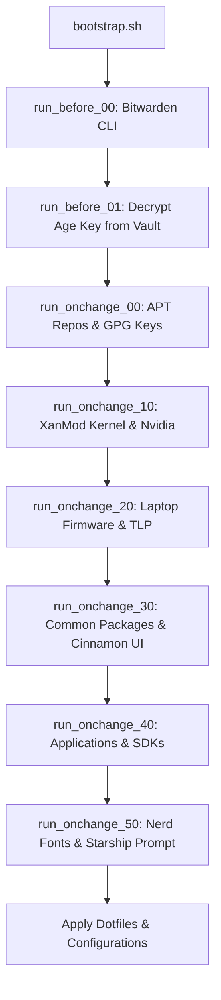

# Yury Smirnov's Dotfiles

Personal Linux development environment and dotfiles repository for Debian-based systems (optimized for Debian Trixie/Testing with Linux Cinnamon desktop), managed using [chezmoi](https://www.chezmoi.io/) and secured with [Age](https://github.com/FiloSottile/age) & [Bitwarden](https://bitwarden.com/).

---

## 📋 Overview

This repository automates the end-to-end setup of a full-featured Linux workstation or laptop. It provisions hardware-specific drivers, kernel enhancements, developer runtimes, desktop applications, theme customizations, and shell tools.

### 🌟 Key Features

* **⚡ One-Command Bootstrap**: Complete system initialization via `bootstrap.sh` with automated Bitwarden integration for secrets retrieval.
* **🔐 Age & Bitwarden Security**: Identity keys and sensitive SSH configuration are encrypted via Age; the secret key is securely stored in Bitwarden Vault.
* **💻 Dynamic Hardware Detection (`.chezmoi.yaml.tmpl`)**:
  * **Laptop Detection**: Automatically installs power management (`tlp`, `thermald`, `powertop`), firmware (`firmware-iwlwifi`), and PipeWire/WirePlumber audio stack.
  * **Nvidia GPU Detection**: Installs proprietary Nvidia drivers (`nvidia-driver-580`, `nvidia-vaapi-driver`), disables `ibt=off` in GRUB, and re-generates kernel configurations.
* **🐧 XanMod Kernel**: Installs the high-performance `linux-xanmod-lts-x64v3` kernel along with necessary compilation tooling.
* **🛠️ Developer Infrastructure & Runtimes**:
  * **SDKMAN!**: Java (Zulu 21.0.8) & Maven (3.9.9).
  * **FNM (Fast Node Manager)**: Automated Node.js LTS management.
  * **Google Antigravity CLI**: `agy` executable provisioning.
  * **Docker Engine**: Official upstream Docker repository setup, user group auto-assignment, and `docker-compose-plugin` / `docker-buildx-plugin`.
* **🎨 Desktop Customization & Themes**:
  * **GTK & Icons**: Arc theme, Papirus icon set, Bibata Modern Ice cursor.
  * **Cinnamon & Nemo**: Pre-configured desktop keybindings, input sources (US + RU with `Alt+Shift` toggle), font sizes, and Nemo list-view preferences.
  * **Fonts & Prompt**: JetBrains Mono Nerd Font paired with [Starship](https://starship.rs/) prompt.
* **📦 Curated Software Suite**:
  * **Browsers**: Zen Browser, system web tools.
  * **IDEs & Editors**: IntelliJ IDEA Ultimate, Textadept, WezTerm.
  * **Communication & Utilities**: Telegram Desktop, Discord, Zoom, Filen Desktop, ExpressVPN, Transmission.

---

## 📁 Repository Structure

```
.
├── .chezmoi.yaml.tmpl                     # Chezmoi configuration template (hardware probing)
├── bootstrap.sh                            # Primary bootstrap entrypoint
├── README.md                              # Repository documentation
├── run_before_00-install-bitwarden-cli.sh # Ensures Bitwarden CLI (bw) is installed
├── run_before_01-decrypt-key.sh.tmpl      # Fetches Age private key from Bitwarden
├── run_onchange_00-add-repositories.sh    # Configures APT repos (XanMod, WezTerm, Docker, non-free)
├── run_onchange_10-install-xanmod.sh.tmpl # Installs XanMod kernel & Nvidia drivers (if present)
├── run_onchange_20-install-laptop-packages.sh.tmpl # Configures laptop power & audio (if laptop)
├── run_onchange_30-install-common-packages.sh      # Installs common CLI tools, GTK themes & UI settings
├── run_onchange_40-install-antigravity.sh # Google Antigravity CLI installer
├── run_onchange_40-install-discord.sh     # Discord .deb installer
├── run_onchange_40-install-docker.sh      # Docker Engine & plugin setup
├── run_onchange_40-install-expressvpn.sh  # ExpressVPN installer
├── run_onchange_40-install-filen.sh       # Filen desktop client installer
├── run_onchange_40-install-git.sh         # Global git config & bash completion
├── run_onchange_40-install-intellij.sh    # IntelliJ IDEA Ultimate installer (/opt/idea)
├── run_onchange_40-install-node-infra.sh  # FNM and Node LTS runtime setup
├── run_onchange_40-install-sdks.sh        # SDKMAN!, Java 21, Maven installation
├── run_onchange_40-install-telegram.sh    # Telegram Desktop installer (/opt/Telegram)
├── run_onchange_40-install-textadept.sh   # Textadept text editor installer (/opt/textadept)
├── run_onchange_40-install-zen.sh         # Zen Browser installer (/opt/zen)
├── run_onchange_40-install-zoom.sh        # Zoom .deb installer
├── run_onchange_50-install-nerd-fonts.sh  # JetBrains Mono Nerd Font & Starship prompt
├── dot_bashrc.tmpl                        # Bash configuration template (~/.bashrc)
├── dot_wezterm.lua                        # WezTerm configuration (~/.wezterm.lua)
├── dot_textadept/
│   └── init.lua                           # Textadept configuration (~/.textadept/init.lua)
├── dot_local/share/applications/          # Custom Desktop Launchers (.desktop files)
│   ├── intellij.desktop
│   └── textadept-gtk.desktop
└── private_dot_ssh/                       # Encrypted SSH configuration and keys
    ├── config.tmpl
    ├── encrypted_private_id_ed25519.age   # Age-encrypted private SSH key
    └── id_ed25519.pub
```

---

## 🚀 Quick Start / Bootstrapping

To set up a fresh Linux machine, run the single-line bootstrap command or run `./bootstrap.sh`:

```bash
curl -fsSL https://raw.githubusercontent.com/yury-smirnov87/dotfiles/main/bootstrap.sh | bash
```

### What `bootstrap.sh` Does:

1. Ensures `~/.local/bin` exists and is in `PATH`.
2. Installs `chezmoi` idempotently into `~/.local/bin`.
3. Downloads and installs the **Bitwarden CLI** (`bw`).
4. Prompts for **Bitwarden login & vault unlock**, setting `BW_SESSION` in the active shell.
5. Fetches the Age secret key from the Bitwarden item named `age-secret` and saves it to `~/.config/chezmoi/key.txt`.
6. Initializes chezmoi from `https://github.com/yury-smirnov87/dotfiles.git`.
7. Executes `chezmoi apply --force` to run all provisioning scripts and apply dotfiles.
8. Reconfigures the chezmoi git remote URL to SSH (`git@github.com:yury-smirnov87/dotfiles.git`) once SSH keys are restored.

---

## 🔄 Execution Lifecycle

Chezmoi runs lifecycle scripts in numerical order:



### Managed Applications & Runtimes Summary

| Category | Component / Tool | Details |
| :--- | :--- | :--- |
| **Shell & Terminal** | Bash, WezTerm, Starship | Gruvbox Material theme, JetBrains Mono Nerd Font, WebGPU support |
| **System Kernel** | XanMod LTS x64v3 | Optional Nvidia drivers (v580) with `ibt=off` GRUB parameter |
| **Development** | Java, Maven, Node.js, Git | SDKMAN! (Java 21 Zulu, Maven 3.9.9), FNM (LTS Node), Git completion |
| **IDEs & Editors** | IntelliJ IDEA, Textadept | Clean desktop integration, `/opt` installations, custom keybindings |
| **Browsers** | Zen Browser | Firefox-based privacy browser with custom desktop entry |
| **Containers** | Docker Engine | `docker-ce`, `docker-compose-plugin`, auto group configuration |
| **Productivity / Media** | Discord, Telegram, Zoom, Filen | Official `.deb` packages & Linux tarballs |
| **VPN & Security** | ExpressVPN, Bitwarden, Age | CLI vault access & encrypted SSH keys |

---

## 🔑 Encryption & Secrets

This repository uses **Age encryption** via chezmoi integration:

* **Recipient Key**: `age1n62t5ygs08dtll40g306jttrdnj7ztqcf5yx5cjhszz6dv0ftuasajjw49`
* **Identity File**: `~/.config/chezmoi/key.txt`
* **Encrypted Assets**: Private SSH identity (`encrypted_private_id_ed25519.age`).

### Re-encrypting / Editing Encrypted Files

To view or edit encrypted files within chezmoi:

```bash
chezmoi edit ~/.ssh/id_ed25519
```

---

## 🛠️ Daily Workflow

Standard commands for maintaining your dotfiles with chezmoi:

```bash
# Check status of local files vs chezmoi source
chezmoi status

# View differences before applying
chezmoi diff

# Apply pending changes
chezmoi apply

# Edit a managed file
chezmoi edit ~/.bashrc

# Navigate to the chezmoi source directory
chezmoi cd

# Commit and push changes
git add .
git commit -m "Update configuration"
git push origin main
```

---

## 📄 License

Personal repository maintained by [Yury Smirnov](https://github.com/yury-smirnov87). Open for reference and reuse.